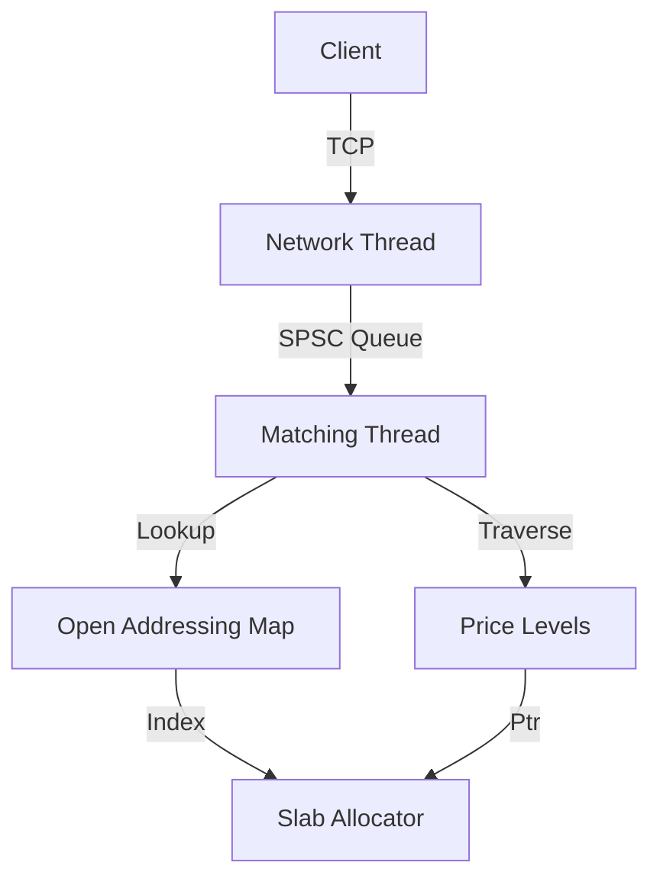

# Fastbook

**Fastbook** is a single-threaded, high-frequency limit order book (LOB) engine written in C++20. It prioritizes mechanical sympathy, cache locality, and zero-allocation on the hot path.

> **Current Branch:** `feature/open-addressing-pool`
>
> This branch replaces the standard library node-based containers with a custom open-addressing hash map and slab allocator to minimize cache misses and memory fragmentation.

## Performance Benchmarks

Benchmarks run on `10,000,000` orders replay (reused ~12.5% of slots).

| Metric | Result |
| :--- | :--- |
| **Throughput** | **~1.67 Million orders/sec** |
| **Avg Latency** | **~375 ns** |
| **p50 Latency** | **50 ns** |
| **p99 Latency** | **425 ns** |
| **p99.9 Latency** | **23.5 μs** |

*Note: Latency measures the time from dequeuing an order to completing the match/insert operation. Network IO is excluded from engine latency metrics.*

## Key Engineering Features

### 1. Memory Architecture (`OrderPool`)
The engine avoids `malloc`/`free` using a custom memory pool.

* **Slab Allocation:** Orders are allocated from pre-reserved contiguous memory blocks ("slabs") to ensure spatial locality.
* **Open Addressing Lookup:**
    * Maps `Order ID` $\to$ `Pool Index`.
    * Uses **Linear Probing** for collision resolution, reducing pointer chasing compared to `std::unordered_map`.
    * **Tombstones** handle cancellations without breaking probe chains.
* **Struct Alignment:** The `Order` struct is strictly padded to **64 bytes** to align with CPU cache lines, preventing false sharing.

### 2. Intrusive Data Structures
Price levels utilize intrusive doubly-linked lists. The `next` and `prev` pointers are embedded directly within the `Order` struct.
* **Benefit:** Eliminates the need for a separate container node allocation.
* **O(1) Removal:** Orders can be cancelled in constant time given their pointer.

### 3. Lock-Free Ingress
Communication between the network thread and the matching engine is handled via a **Single-Producer-Single-Consumer (SPSC)** ring buffer (capacity 262,144), minimizing synchronization overhead.

## Architecture Overview



## Build & Run

### Prerequisites
* C++20 compliant compiler (GCC 10+ / Clang 12+)
* CMake 3.10+
* Python 3 (for client replay)

### 1. Generate Test Data
Generate the dataset of random orders before running the benchmark.
```bash
python3 client/gen_orders.py
```

### 2. Build
```bash
cmake --build build-release -j
```

### 3. Run the Engine
Start the server (binds to port 8080):
```bash
./build-release/fastbook
```

### 4. Run the Benchmark Client
In a separate terminal, run the python replay script to blast orders at the engine:
```bash
python3 client/client.py
```

## Telemetry & Analysis
The engine dumps telemetry to `stdout` every 1M orders and generates a shape snapshot on exit.

* **`final_shape.csv`**: A CSV dump of the order book depth distribution (Tick Delta vs Volume), useful for visualizing market shape after a run.
* **Real-time Metrics**:
    * `allocations`: Total slots used from slab.
    * `reused`: Percentage of allocations served from the freelist (tombstone recycling).
    * `stale cancels`: Measures efficiency of cancellation requests for already-filled orders.

## Roadmap

* **Level Container Optimization:** Refactor the `Orderbook` to use hierarchy bitset (for hot levels) + (map for cold levels) for managing Price Levels (replacing `std::vector<Level>`). This will eliminate the $O(N)$ overhead of shifting vector elements during order deletion. 
* **Ingestion Optimization:** Implement batch reading for network sockets (e.g., `recvmmsg`) to amortize syscall overhead across multiple messages.
