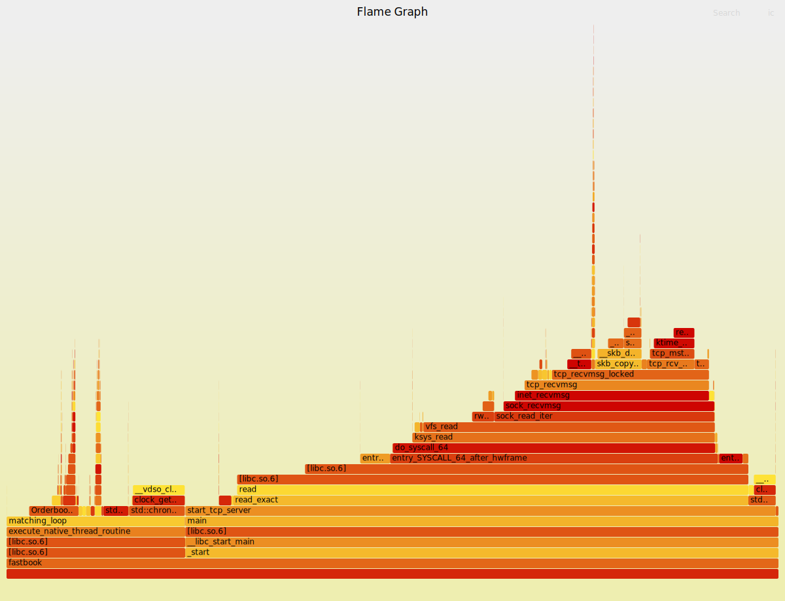
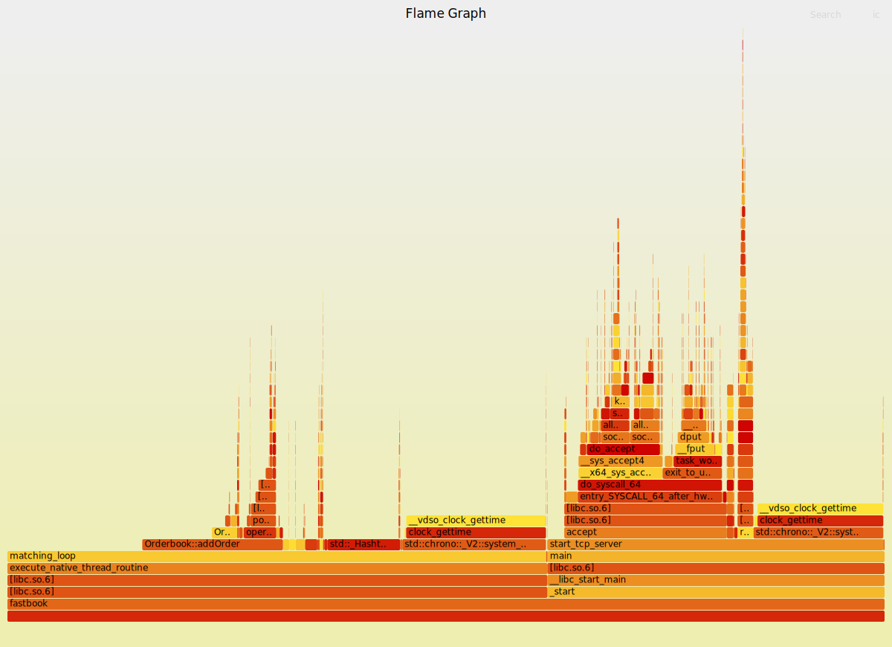
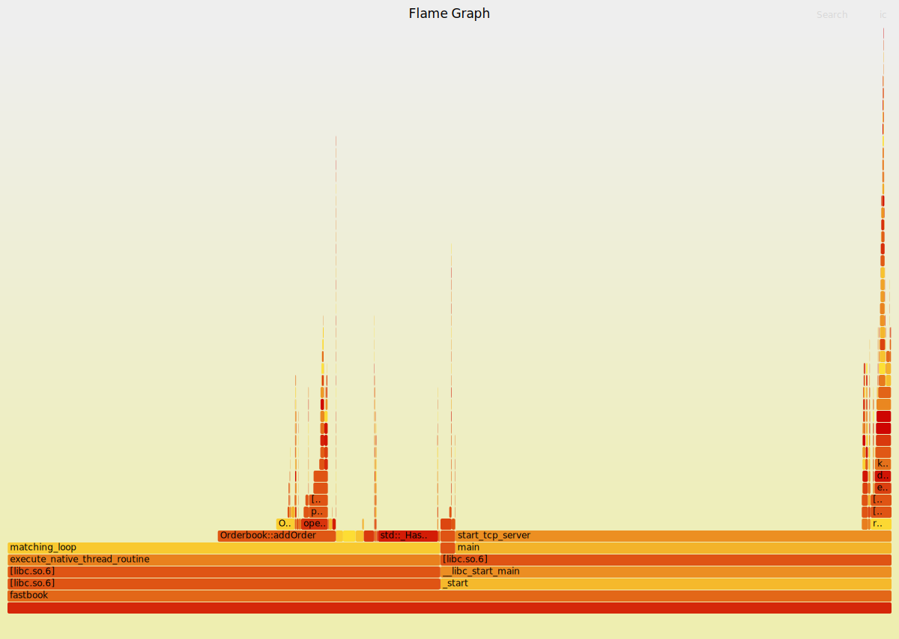
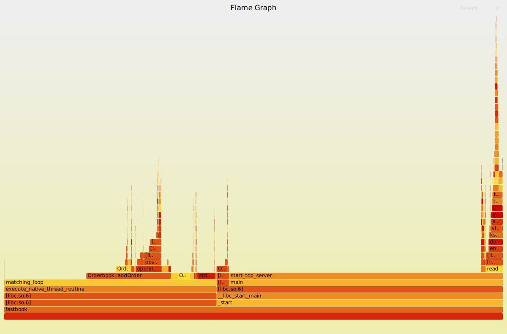
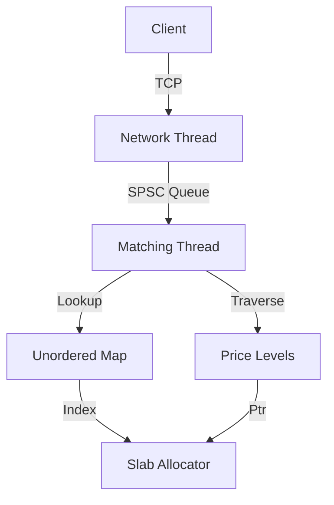

# Fastbook

**Fastbook** is an exploratory single-threaded, high-frequency limit order book (LOB) engine written in C++20. It prioritizes mechanical sympathy and cache locality. Telemetry only works on x86-64 architecture with support for `__rdtsc` intrinsics.

Motivation: This project is a dedicated testbed for strengthening mechanical sympathy through the hands-on application of low-latency C++ concepts, built specifically to tackle and explore the rigorous engineering constraints found in High-Frequency Trading (HFT) environments.

## Performance Benchmarks

Benchmarks run on a `10,000,000` orders replay (reused ~12.5% of slots).

**Test Environment Preface: TCP Loopback**
All primary benchmarks are executed using local TCP loopback (`127.0.0.1`). Standard TCP/IP over physical Ethernet introduces massive OS kernel overhead (hardware IRQs, DMA transfers, and `ksys_read` context switches) which artificially throttles ingestion. By using the loopback interface, the kernel bypasses the physical NIC and performs direct memory-to-memory handoffs. This simulates the wire-to-user-space speeds achieved by production Kernel Bypass technologies (DPDK, Solarflare) and allows us to isolate and stress-test the raw mechanical sympathy of the C++ matching engine.

To prevent the "observer effect" (where the overhead of the timer itself slows down the engine), performance is measured across two distinct build profiles:

### 1. Latency Profile (Apples-to-Apples Historical Benchmark)
**Build Flag:** `-DENABLE_TELEMETRY=ON`
This profile injects x86-64 hardware intrinsics (`__rdtsc` / `__rdtscp`) into the hot path to measure microsecond-perfect execution time for every individual order. This profile maintains continuity with historical benchmarks by keeping telemetry active.

| Metric | Result |
| :--- | :--- |
| **Throughput** | **~5.82 Million orders/sec** |
| **Avg Latency** | **~133 ns** |
| **p50 Latency** | **64 ns** |
| **p99 Latency** | **512 ns** |
| **p99.9 Latency** | **1920 ns** |

*Note: Latency measures the time from dequeuing an order to completing the match/insert operation. Network IO is excluded from engine latency metrics.*

### 2. Max Throughput Profile (Bare-Metal)
**Build Flag:** `-DENABLE_TELEMETRY=OFF`
This profile completely strips all per-message hardware timers from the hot path, allowing the matching engine to run at its true physical limit. Used exclusively for calculating maximum system throughput and gathering unpolluted hardware cache metrics.

| Metric | Result |
| :--- | :--- |
| **Throughput** | **~7.43 Million orders/sec** |
| **Time to Process 10M** | **~1.34 seconds** |

#### Hardware Telemetry (perf)
| L1 Cache Miss Rate | Branch Misprediction | TLB Miss | Minor Faults |
| :--- | :--- | :--- | :--- |
| 5.18% | 4.19% | 3.38% | 11,776 |

### 3. Physical Network Profile (Standard TCP/Ethernet)
**Build Flag:** `-DENABLE_TELEMETRY=OFF` (Run over physical WLAN/Ethernet).
This profile measures the real-world limitations of the standard Linux network stack. While the engine matches at ~7.4M ops/sec, physical cross-machine ingestion is hard-capped by OS kernel context switching.

| Metric | Result |
| :--- | :--- |
| **Throughput** | **~3.67 Million orders/sec** |

*Note on Network Bottlenecks: Flamegraph profiling (see `assets/tcp_stack_flamegraph.svg`) confirms that during physical network ingestion, the C++ matching engine spends the majority of its time starved (spin-waiting). Throughput is hard-capped by kernel context switches (`entry_SYSCALL_64`), hardware interrupts (IRQs), and memory copies from kernel-space to user-space inside the `ksys_read` stack. Achieving the engine's true 7.4M+ capacity over a physical network requires Kernel Bypass technologies.*

### Hardware Telemetry History
Measured via Linux `perf` hardware performance counters.

| Date | L1 Cache Miss Rate | Branch Misprediction | TLB Miss | Minor Faults | Notes |
| :--- | :--- | :--- | :--- | :--- | :--- | 
| **Apr 2026** | 5.18% | 4.19% | 3.38% | 11,776 | Baseline matching engine utilizing `std::unordered_map` for lookups, a `std::vector` of price levels, and dynamic heap allocation. No memory pinning or warmup phase. |

## The Performance Journey
Building this engine has been an ongoing exercise in profiling, identifying, and systematically eliminating bottlenecks.

* **Baseline (~900k orders/sec):** The initial naive implementation using standard blocking I/O and per-message reads.
* **Zero-Copy Ingestion (~1.76M orders/sec):** Transitioned the server to use non-blocking sockets (`O_NONBLOCK`) and eliminated deserialization overhead by casting raw network byte buffers directly into `Client::Order` structs.
   <p align="center">
  
   </p>
* **Syscall Amortization (~5.7M orders/sec):** Flamegraph profiling revealed the system was bottlenecked by the kernel context switch (`entry_SYSCALL_64_after_hwframe`) on every read. Implemented a 64KB user-space buffer to amortize `read()` syscalls, paired with `_mm_pause()` spin-waits for polling.
   <p align="center">
  
   </p>
* **Hardware Telemetry Integration (~5.8M orders/sec):** Replaced `std::chrono` with x86-64 `__rdtsc` intrinsics. Flamegraphs confirm the network layer outpaces the matching engine, resulting in backpressure on the SPSC queue.
   <p align="center">
  
   </p>
* **Max Throughput Profiling (~7.43M orders/sec):** Introduced a macro-toggled compile profile that completely removes the hardware clock from the binary, removing observer-effect overhead.
   <p align="center">
  
   </p>

## Key Engineering Features

### 1. Memory Architecture (`OrderPool`) *(WIP: `feature/open-addressing-pool`)*
The engine avoids `malloc`/`free` in the orderpool using a custom memory pool.

* **Slab Allocation:** Orders are allocated from pre-reserved contiguous memory blocks ("slabs") to ensure spatial locality.
* **Open Addressing Lookup:**
    * Maps `Order ID` -> `Pool Index`.
    * Uses **Linear Probing** for collision resolution, reducing pointer chasing compared to `std::unordered_map`.
    * **Tombstones** handle cancellations without breaking probe chains.
* **Struct Alignment:** The `Order` struct is strictly padded to **64 bytes** to align with CPU cache lines, preventing false sharing.

### 2. Intrusive Data Structures
Price levels utilize intrusive doubly-linked lists. The `next` and `prev` pointers are embedded directly within the `Order` struct.
* **Benefit:** Eliminates the need for a separate container node allocation.
* **O(1) Removal:** Orders can be cancelled in constant time given their pointer.

### 3. Lock-Free Ingress
Communication between the network thread and the matching engine is handled via a **Single-Producer-Single-Consumer (SPSC)** ring buffer, minimizing synchronization overhead.

## Architecture Overview


```mermaid
graph TD
    A[Client] -->|TCP| B[Network Thread]
    B -->|SPSC Queue| C[Matching Thread]
    C -->|Lookup| D[Unordered Map]
    C -->|Traverse| E[Price Levels]
    D -->|Index| F[Slab Allocator]
    E -->|Ptr| F
```

## Build & Run

### Prerequisites
* C++20 compliant compiler (GCC 10+ / Clang 12+)
* CMake 3.10+
* Python 3 (for client replay)

### 1. Generate Test Data
Generate the dataset of random orders before running the benchmark.
```bash
python3 client/gen_orders.py
```

### 2. Build Profiles
The project utilizes CMake flags to cleanly separate software latency telemetry from hardware profiling, preventing observer-effect interference.

Build for Latency Metrics (Software Timer):
```bash
cmake -B build-release -DCMAKE_BUILD_TYPE=Release -DENABLE_TELEMETRY=ON
cmake --build build-release -j
```
Build for Hardware Profiling (Clean Binary):
```bash
cmake -B build-release -DCMAKE_BUILD_TYPE=Release -DENABLE_TELEMETRY=OFF
cmake --build build-release -j
```


### 3. Run the Benchmark Client
In a separate terminal, run the python replay script to send orders to the engine:
```bash
python3 client/client.py
```

### 4. Run the Engine
Start the server (binds to port 8080):
```bash
./build-release/fastbook
```


## Telemetry & Analysis
The engine dumps telemetry to `stdout` every 1M orders and generates a shape snapshot on exit.

* **`final_shape.csv`**: A CSV dump of the order book depth distribution (Tick Delta vs Volume), useful for visualizing market shape after a run.
* **Real-time Metrics**:
    * `allocations`: Total slots used from slab.
    * `reused`: Percentage of allocations served from the freelist (tombstone recycling).
    * `stale cancels`: Measures efficiency of cancellation requests for already-filled orders.

## Roadmap

* **Level Container Optimization:** Refactor the `Orderbook` to use hierarchy bitset (for hot levels) + (map for cold levels) for managing Price Levels (replacing `std::vector<Level>`). This will eliminate the $O(N)$ overhead of shifting vector elements during order deletion. 

* **Kernel Bypass / Advanced I/O:** Evolve the user-space buffering system to use `recvmmsg` or `io_uring` to further push the boundaries of network ingestion.


I also want to preface the tcp loopback in my normal benchmarking
